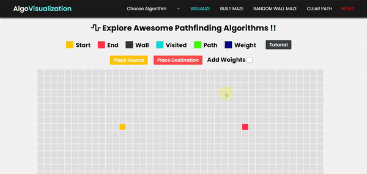

# Algo Visualization

Visualize and learn various Pathfinding, Sorting and Searching algorithms via awesome visualization website and good quality study material, <a href = "https://algo-visualization.000webhostapp.com/templates/index.php"> Click here </a> to visit.

### Pathfinding Algorithms

* Breadth First Search
* Depth First Search
* Best First Search
* Dijkstra Algorithm
* Astar Algorithm

### Sorting Algorithms

* Bubble Sort
* Insertion Sort
* Selection Sort
* Merge Sort
* Quick Sort
* Heap Sort

### Searching Algorithms

* Linear Search
* Jump Search
* Binary Search
* Exponential Search
